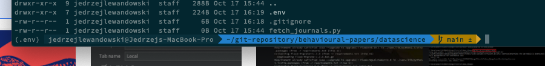
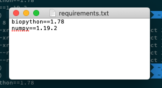

# Lekcja zero i pół — wirtualne środowiska i biblioteki

- [<- Index](../README.md)

[TOC]


## Rozmowa 1 — czym jest biblioteka

To cudzy kod, który w wygodny sposób pozwala za pomocą pojedynczych funkcji wywoływać czasem tysiące linii kodu.

Np biblioteka Bio.Entrez, która pozwala przeszukiwać Pubmed w wygodny sposób.

Dzięki bibliotece przeszukanie pubmedu wygląda tak:

```python
from Bio.Entrez import efetch

resultsHandle = efetch(db='pubmed', id=pmid, retmode='text', rettype='abstract')

print resultsHandle.read()
```

Gdyby nie biblioteka, musielibyśmy to zrobić w około 40 liniach kodu. Biblioteka zawiera je w środku, ale udostępnia nam ładną funkcję, która pozwala nam w wygodny sposób je odczytać w trzech liniach kodu


Żeby móc używać biblioteki trzeba ją zainstalować. Tutaj pojawia się pewien kłopot. Czasem różne projekty wymagają tej samej biblioteki w innych wersjach. 

Tu z pomocą przychodzą wirtualne środowiska.


## Rozmowa 2 — czym jest środowisko wirtualne

Wirtualne środowisko pozwala nam zainstalować pythona razem z potrzebnymi bibliotekami ODDZIELNIE dla każdego projektu.

Dzięki temu:

1. Każdy projekt może korzystać z innej wersji pythona
2. Każdy projekt może korzystać z innych bibliotek
3. Możemy zrobić listę bibliotek (`requirements.txt`), które będą się instalować automatycznie 
4. Gdy razem pracujemy (np. nad artykułem), możemy wysłać koleżance/koledze nasz kod i on jedną komendą zainstaluje sobie wszystkie potrzebne biblioteki.
5. Każdy, kto sklonuje nasz kod z repozytorium na githubie na swój komputer, będzie mógł jedną komendą zainstalować potrzebne biblioteki.


## Zadanie 3 — tworzenie wirtualnego środowiska

1. Najpierw zainstaluj virtualenv — manager wirtualnych środowisk

```bash
$ pip3 install virtualenv

# or

$ pip install virtualenv
```


2. Potem wejdź do folderu projektu i stwórz tam subfolder z wirtualnym środowiskiem. Nazwiemy ten folder .`env` ale nazwa jest dowolna

```bash
$ cd ~/path/to/project

# Then

$ virtualenv .env -p python3

# or

$ virtualenv .env -p python

# or

$ virtualenv .env -p C:\Python\Python36\python.exe
```


3. Musisz dodać ten folder do plików ignorowanych przez **git**. Nie chcemy, żeby ten folder znalazł się w repozytorium. Wpisz:

```bash
$ echo ".env/" >> .gitignore
```

Ta komenda wpisała nową linię `.env/` do pliku `.gitignore` mówiąc git-owi, żeby tego pliku nie włączać w poczet repozytorium


4. Aktywuj środowisko:

   ```bash
   # Na linuksie: 
   $ source .env/bin/activate 
   
   # Na windowsie:
   $ .env\Scripts\activate.bat
   ```


5. Za każdym razem jak otworzysz terminal — będziesz musiał aktywować to środowisko. Powinieneś zobaczyć nazwę środowiska przed tzw promptem (miejscem do wpisywania poleceń), czyli w lewym dolnym rogu terminala:

   


### Zadanie 4 — instalowanie biblioteki

1. Jeżeli nasze wirtualne środowisko jest już aktywowane, to możemy zacząć instalować biblioteki

   ```bash
   $ pip install biopython
   ```

2. Teraz musimy powiedzieć pip-owi, żeby stworzył listę bibliotek, żeby inni mogli je łatwo instalować

   ```bash
   $ pip freeze > requirements.txt
   ```

3. To polecenie stworzyło nam plik requirements.txt, którego zawartość wygląda tak:

   

4. Teraz, gdy ktoś obcy pobierze nasze repozytorium, to może zainstalować wszystkie potrzebne biblioteki za pomocą trzech poleceń:

   ```bash
   $ virtualenv .env -p C:\Python\Python36\python.exe # Tworzy środowisko wirtualne
   $ .env\Scripts\activate.bat # Aktywuje środowisko wirtualne
   $ pip install -r requirements.txt # Instaluje potrzebne biblioteki
   ```

5. Natomiast za każdym razem, gdy zainstalujemy nową bibliotekę musimy pamiętać, żeby zamrozić listę bibliotek poleceniem `pip freeze > requirements.txt`

